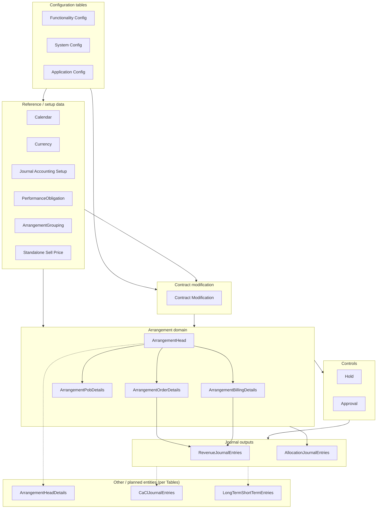

# Flow diagram — `Tables`

This diagram reflects the groupings and entities listed in [`Tables`](./Tables). Arrows show a typical **configuration → gating → arrangement → journals** dependency direction (not every FK from `db_script.sql`).

## Legend

| Block | Meaning |
|--------|--------|
| **Configuration tables** | Environment and behaviour settings before transactional data. |
| **Contract modification** | Rules and timing that affect arrangements (see `contractModification*` in `db_script.sql`). |
| **Reference / setup** | Periods, currency, accounts, POB templates, grouping, SSP used when building or posting arrangements. |
| **Hold / Approval** | Workflow gates before recognition or release (placeholders in `Tables`; wire to Camunda / batch as you implement). |
| **Arrangement domain** | Core arrangement header and line-level detail used for revenue and billing. |
| **Journal outputs** | Posted journal lines (`RevenueJournalEntries`, `AllocationJournalEntries`). |
| **Dashed** | Items listed under *Other / planned* in `Tables` that are not necessarily present in `db_script.sql` yet. |

To edit the diagram, change the Mermaid block in this file; preview in any Mermaid-capable viewer or GitHub.
